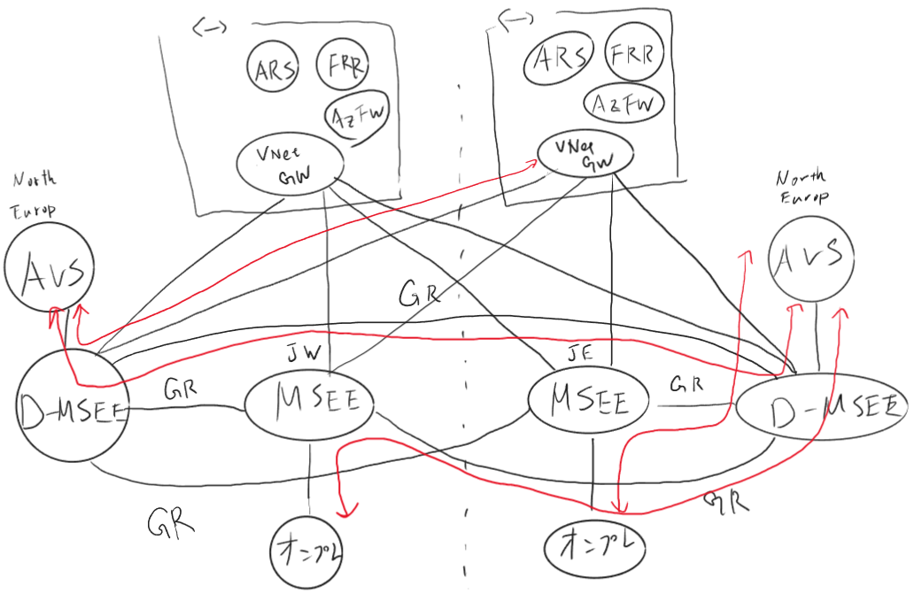

# AVS と ER を接続する君(作成中)

## 事前に必要なもの

- [ ] ExpressRoute Circuit x 2(Global Reach が使えるリージョン)
- [ ] AVS x 2(Global Reach が使えるリージョン)

## 目指す構成

## 展開

1. ExpressRoute Circuit と AVS を作成しておく
2. Global Reach で接続しておく
   1. D-MSEE 間
   2. D-MSEE(東西) - MSEE(東西) 間
   3. D-MSEE(東西) - MSEE(西東) 間
3. AuthKey、Peering URL をメモっておく
4. terraform の設定ファイルを作る
5. terraform の実行
6. VM の frr を設定する

## frr.conf サンプル

https://gist.githubusercontent.com/tsubasaxZZZ/8a16096fd90b931ea2a005d38e5d8426/raw/defe290133e606dba4bbe7d2ab6efe314195f25c/east.conf

Special thanks
>https://zenn.dev/skmkzyk/articles/azure-route-server-frroutin  
>https://blog.aimless.jp/archives/2022/07/create-default-route-to-firewall-with-route-server-nexthop/