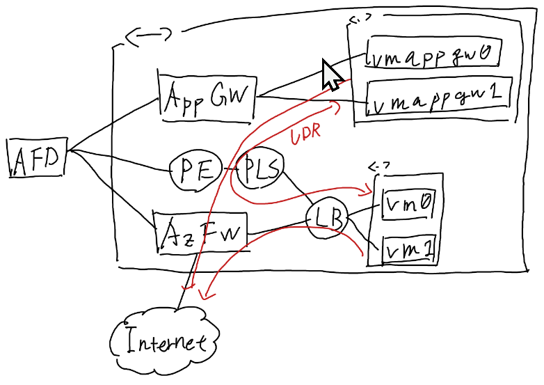
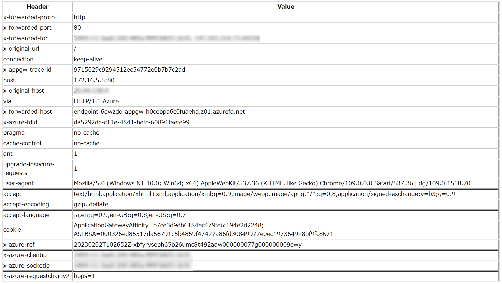

# What is this?



## Specification

- To access the Internet, resources will pass through Azure Firewall.
- For access between vm and vmappgw, these will be through Azure Firewall.

## Post-deployment tasks

- Change Azure Firewall DNAT settings
- Approve PLS

## Installed tools for VM

- nginx
- nodejs
- npm

## Sample application

To use copy following code to `app.js` and run `node app.js`:

```javascript
const express = require('express')
const app = express()
const port = 80

app.get('/', (req, res) => {
  res.set('Cache-Control', 'no-store')
  console.log(console.log(JSON.stringify(req.headers)))
  res.send('<table border=1><tr><th>Header</th><th>Value</th></tr>' + Object.keys(req.headers).map((key) => `<tr><td>${key}</td><td>${req.headers[key]}</td></tr>`).join('') + '</table>')
})

app.listen(port, () => {
  console.log(`Example app listening on port ${port}`)
})
```

