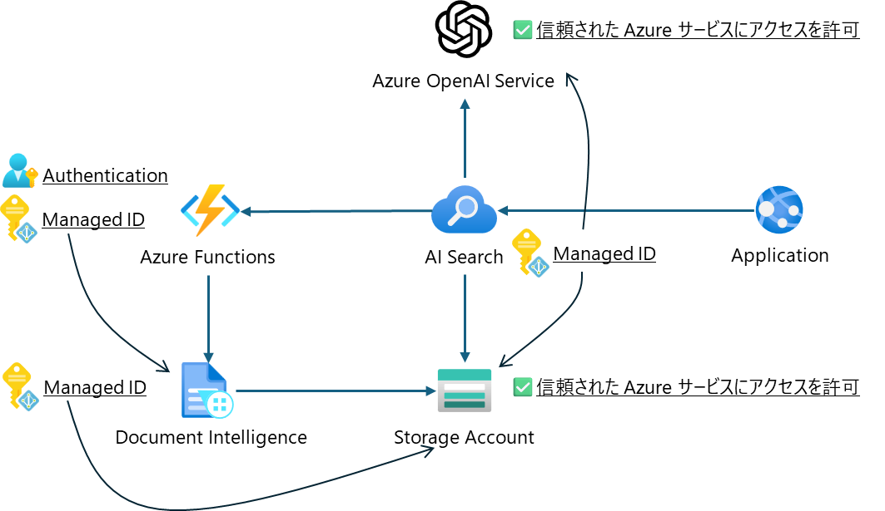

# これは何か

AI 関連のリソースを展開する Terraform です。

- Terraform では、リソースの一式の展開とManaged IDによるRBACの割り当てをします。
- Azure Functions のアプリケーションの展開と、AI Search のインデックスやスキルセットはリソース展開後に手動で設定する必要があります。

## MyFunctionProj
AI Search から呼び出される Azure Functions のアプリケーションが含まれています。

`endpoint` には、Document Intelligence のエンドポイントを指定してください。

## aisearch
AI Search のインデックス、インデクサー、スキルセットの JSON が含まれています。
