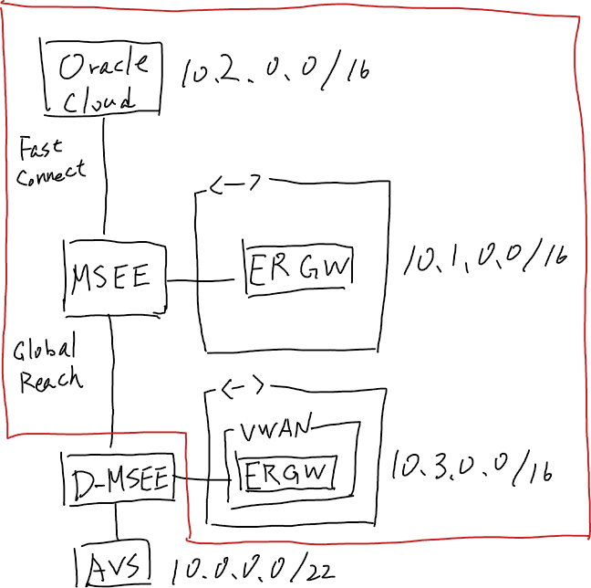

# What's this

This is a Terraform module that creates a Virtual WAN and an ER Gateway, OCI.
Also it connects the ER to the OCI VCN by using FastConnect.

This is consist of the following modules:
- azure
  - Deploy an ER Gateway and a Virtual WAN in Azure
  - A Virtual WAN won't be created as default. If you want to create a Virtual WAN, please set `deploy_vwan` to `true` on terraform.tfvars.
- oci
  - Deploy a FastConnect in OCI.
