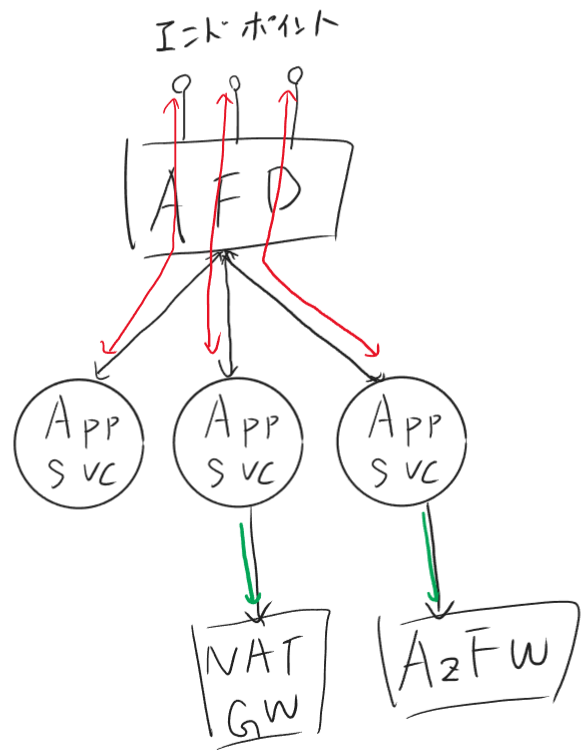

# Web Apps VNet integ test-bed

App Service VNet integration is a feature that allows you to deploy your web app into a virtual network. This allows you to access resources in the virtual network from your web app, and to access your web app from resources in the virtual network.

