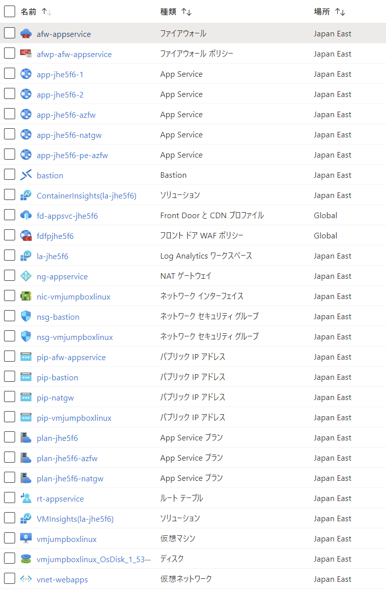

# Web Apps VNet integ test-bed

App Service VNet integration is a feature that allows you to deploy your web app into a virtual network. This allows you to access resources in the virtual network from your web app, and to access your web app from resources in the virtual network.

## 構成図


### 展開されるもの

- App Service x 5
  - 送信制御無し
  - 送信制御無し+カスタムコンテナ
  - NATGW用
  - Azure FW用
  - Azure FW + AFD->PrivateEndpoint用
- 送信制御用リソース
  - NATGW
  - Azure Firewall + ルート テーブル
- Bastion
- 踏み台用 LinuxVM
- Front Door
- Log Analytics



## デプロイ方法

### 0. git clone

```sh
git clone https://github.com/tsubasaxZZZ/terraform-azure.git
cd webapps-vnetinteg-with-frontdoor
```

### 1. 事前準備

Terraform で Azure のリソースを展開するための認証情報を取得します。以下はサービス プリンシパルを使う方法ですが、Azure CLI のクレデンシャルを使用する方法が推奨です。

```sh
# サービスプリンシパルの作成
az ad sp create-for-rbac --name terraform-deploy --role Contributor

export ARM_CLIENT_ID="<Client ID>"
export ARM_CLIENT_SECRET="<Client Secret>"
export ARM_SUBSCRIPTION_ID="<Subscription ID>"
export ARM_TENANT_ID="<Tenant ID>"
```

terraform.tfvars の内容を編集します。
```
rg = {
  name     = "rg-webapps-with-afd-jpeast"
  location = "japaneast" //ゾーンのあるリージョンが対象
}
ssh_public_key = "<踏み台LinuxVM用SSH公開鍵>"

```

### 2. 展開

#### 1. Terraform の実行

```sh
terraform init
terraform plan -out tfplan
terraform apply "tfplan"
```

#### 2. Front Door のエンドポイントと配信元の関連付け

現在、Terraform では Front Door のエンドポイントと配信元の関連付けが出来ないため手動で行います。


#### 3. Private Endpoint の承認

現在、Terraform では Private Endpoint の承認処理が出来ないため手動で行います。Front Door のバックエンドの App Service のネットワーク設定で承認処理を実行します。


